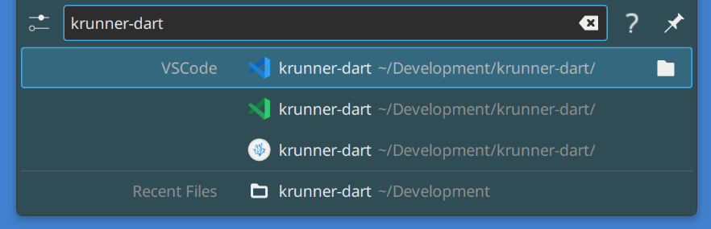

A KRunner plugin / "runner" that lists VSCode's recent workspaces

- Quickly re-open the workspace in VSCode by pressing `Enter`.
- Open a file browser to the workspace's directory by pressing `Shift` + `Enter`.


<br>


Available on [store.kde.org](https://store.kde.org/p/1653111/).


<br>





<br>


https://user-images.githubusercontent.com/9575627/143503598-47a7ca08-644d-4ba8-9f33-3baf8143fcbf.mp4


<br>


## Building

```bash
dart pub get
```

```bash
dart compile exe -o package/vscode_runner bin/vscode_runner.dart
```


<br>


## Install plugin

```bash
package/install.sh
```


<br>


## Uninstall plugin

```bash
package/uninstall.sh
```
